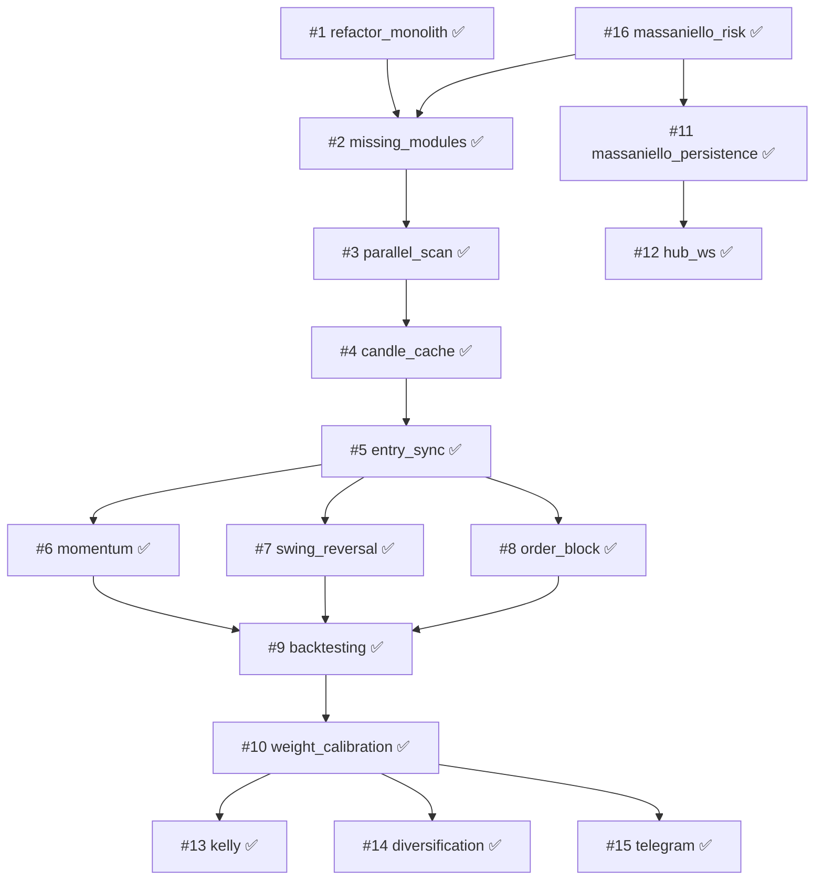

# Roadmap — quotex-hft-bot

> **Fuente de verdad operativa:** `feature_list.json` (estados y acceptance criteria).
> Este documento es la vista legible del roadmap: fases, dependencias y progreso.
>
> **Última actualización:** 2026-07-04
>
> **Estado:** **22/22 features completadas** — backlog del roadmap terminado.

---

## Resumen ejecutivo

| Métrica | Valor |
|---------|-------|
| Features totales | **22** (16 global + 6 STRAT-A) |
| Completadas | **22** (100 %) |
| En curso | 0 |
| Track STRAT-A | **6 / 6** ✅ completo |
| Tests | 251 passing (`python -m pytest tests/ -q`) |
| Gestión de riesgo activa | **Massaniello** (5 ops / 3 ITM / 60 min / PRACTICE) |

### Estado operativo

- Credenciales Quotex en `.env` — login **PRACTICE OK** (2026-06-30).
- Validación demo STRAT-A (#22) **completa** — 10 rechazos reject-first en PRACTICE (2026-07-02).
- Validación live del sistema completo **pendiente**.

---

## Estado por fase

### Fase 0 — Fundamentos ✅

| ID | Feature | Estado | Notas |
|----|---------|--------|-------|
| 1 | `refactor_monolith` | ✅ done | Monolito → `connection`, `scanner`, `executor`, `strat_a`, `strat_b` |
| 16 | `massaniello_risk` | ✅ done | Reemplaza martingala; `massaniello_engine.py` + `massaniello_risk.py` |
| 2 | `implement_missing_modules` | ✅ done | SMC + `filter_and_sell_otc` |

### Fase 1 — Rendimiento del scanner ✅

| ID | Feature | Estado | Depende de |
|----|---------|--------|------------|
| 3 | `parallel_asset_scan` | ✅ done | #2 |
| 4 | `candle_cache` | ✅ done | #3 |
| 5 | `entry_sync_precision` | ✅ done | #4 |

### Fase 2 — Nuevas estrategias ✅

| ID | Feature | Estado | Depende de |
|----|---------|--------|------------|
| 6 | `strategy_momentum_1m` | ✅ done | #5 |
| 7 | `strategy_reversal_swing` | ✅ done | #5 |
| 8 | `strategy_order_block` | ✅ done | #5 |

### Track STRAT-A — Estrategia consolidación 5m ✅

> Detalle completo: `docs/ROADMAP_STRAT_A.md`

| ID | Feature | Estado | Depende de |
|----|---------|--------|------------|
| 17 | `strat_a_evaluate` | ✅ done | #1, #5 |
| 18 | `strat_a_test_suite` | ✅ done | #17 |
| 19 | `strat_a_quality_filters` | ✅ done | #18 |
| 20 | `strat_a_htf_zone_wiring` | ✅ done | #19 |
| 21 | `strat_a_ob_prefetch` | ✅ done | #20 |
| 22 | `strat_a_live_validation` | ✅ done | #21 |

### Fase 3 — Inteligencia y validación ✅

| ID | Feature | Estado | Depende de |
|----|---------|--------|------------|
| 9 | `backtesting_engine` | ✅ done | Fase 2 |
| 10 | `dynamic_weight_calibration` | ✅ done | #9 |

### Fase 4 — Operaciones y monitoreo ✅

| ID | Feature | Estado | Depende de |
|----|---------|--------|------------|
| 11 | `massaniello_persistence` | ✅ done | #16 |
| 12 | `hub_live_websocket` | ✅ done | #11 |
| 13 | `kelly_criterion_sizing` | ✅ done | #10 |
| 14 | `diversification_enforcer` | ✅ done | #10 |
| 15 | `telegram_alerts` | ✅ done | #10 |

---

## Diagrama de dependencias

---

## Módulos existentes (`src/`)

| Módulo | Rol | Feature origen |
|--------|-----|----------------|
| `consolidation_bot.py` | Facade / orquestador | #1 |
| `connection.py` | I/O broker (velas, órdenes, reconexión) | #1 |
| `scanner.py` | Escaneo y orquestación de señales | #1 |
| `parallel_fetch.py` | Prefetch paralelo de velas | #3 |
| `candle_cache.py` | Caché incremental por activo/tf | #4 |
| `entry_sync.py` | Sincronización open 1m (<300ms) | #5 |
| `executor.py` | Ejecución, ciclo, gestión de capital | #1, #16 |
| `strat_a.py` | Estrategia consolidación (pura) | #1 |
| `strat_b.py` | Estrategia Spring/Upthrust (pura) | #1 |
| `strat_momentum.py` | Estrategia momentum 1m | #6 |
| `strat_reversal_swing.py` | Estrategia reversión swing | #7 |
| `strat_order_block.py` | Estrategia order block | #8 |
| `backtester.py` | Motor de backtesting grid-search | #9 |
| `weight_calibrator.py` | Calibración dinámica de pesos del scorer | #10 |
| `massaniello_persistence.py` | Persistencia SQLite de sesiones Massaniello | #11 |
| `massaniello_engine.py` | Motor matemático Massaniello | #16 |
| `massaniello_risk.py` | Gestor de sesión y stakes | #16 |
| `kelly_sizer.py` | Kelly Criterion sizing | #13 |
| `diversification_enforcer.py` | Forzar diversificación de activos | #14 |
| `alerter.py` | Alertas Telegram | #15 |
| `config.py` | Constantes operativas | #1 |
| `models.py`, `errors.py`, `loop_utils.py` | Soporte | #1 |
| `entry_scorer.py`, `trade_journal.py` | Scoring y persistencia | pre-existente |
| `martingale_calculator.py` | **Deprecado** — no usar en código nuevo | legacy |

### Módulos SMC ✅

- `smc_auto_trader.py`
- `smc_decision_engine.py`
- `smc_analysis.py`
- `filter_and_sell_otc.py`

---

## Objetivo de sesión actual (Massaniello)

Configuración activa en `src/config.py`:

| Parámetro | Valor |
|-----------|-------|
| `MASSANIELLO_OPERATIONS` | 5 entradas por sesión |
| `MASSANIELLO_EXPECTED_WINS` | 3 ITM requeridos |
| `SESSION_MAX_MIN` | 60 minutos |
| Cuenta | PRACTICE (demo forzada) |

**Criterio de éxito demo:** 5 entradas con estrategia A o B, al menos 3 ganadas, dentro de 1 hora.
Log esperado: `🎯 SESIÓN MASSANIELLO CUMPLIDA`.

---

## Próximo paso recomendado

**Validación live del sistema completo** — ejecutar el bot con todas las estrategias integradas (#6, #7, #8, #17–#22), pesos calibrados (#10), Kelly sizing (#13), diversificación (#14) y alertas (#15) en PRACTICE.

---

## Cambios de roadmap (changelog)

| Fecha | Cambio |
|-------|--------|
| 2026-06-29 | Creación del harness SDD (15 features iniciales) |
| 2026-06-29 | #1 `refactor_monolith` completada |
| 2026-06-29 | #16 `massaniello_risk` añadida y completada |
| 2026-06-29 | #11 renombrada: `martingale_persistence` → `massaniello_persistence` |
| 2026-06-29 | #2 actualizada: `config.py` ya no es alcance (existe desde #1) |
| 2026-06-29 | #6, #13 actualizadas: referencias a Massaniello en lugar de martingala |
| 2026-06-29 | Documento `docs/ROADMAP.md` creado |
| 2026-06-29 | Carpeta `/agent` creada — workflow autónomo (`START.md`, handoff, tasks) |
| 2026-06-30 | #2 `implement_missing_modules` completada |
| 2026-06-30 | #3 `parallel_asset_scan` completada |
| 2026-06-30 | #4, #5, #6 completadas — progreso 7/16 |
| 2026-06-30 | Track STRAT-A creado (#17–#22) |
| 2026-07-02 | Track STRAT-A completado (#17–#22 done); progreso 13/22 |
| 2026-07-04 | Batch global completado (#7–#15); progreso **22/22** — roadmap terminado |
