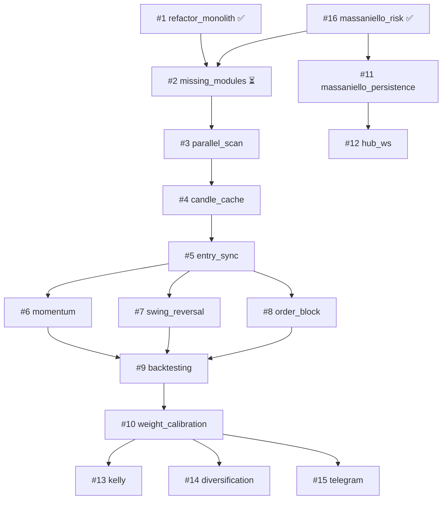

# Roadmap — quotex-hft-bot

> **Fuente de verdad operativa:** `feature_list.json` (estados y acceptance criteria).
> Este documento es la vista legible del roadmap: fases, dependencias y progreso.
>
> **Última actualización:** 2026-06-29

---

## Resumen ejecutivo

| Métrica | Valor |
|---------|-------|
| Features totales | 16 |
| Completadas | **4** (25 %) |
| En curso | 0 |
| Siguiente recomendada | **#4** `candle_cache` |
| Tests | 61 passing (`python -m pytest tests/ -v`) |
| Gestión de riesgo activa | **Massaniello** (5 ops / 3 ITM / 60 min / PRACTICE) |

### Bloqueo operativo

- Credenciales Quotex en `.env` rechazadas por el broker (*login inválido*).
- Validación demo en vivo pendiente: meta **5 entradas / 3 ganadas en 1 hora**.

---

## Estado por fase

### Fase 0 — Fundamentos ✅ parcial

| ID | Feature | Estado | Notas |
|----|---------|--------|-------|
| 1 | `refactor_monolith` | ✅ done | Monolito → `connection`, `scanner`, `executor`, `strat_a`, `strat_b` |
| 16 | `massaniello_risk` | ✅ done | Reemplaza martingala; `massaniello_engine.py` + `massaniello_risk.py` |
| 2 | `implement_missing_modules` | ✅ done | SMC + `filter_and_sell_otc` |

### Fase 1 — Rendimiento del scanner

| ID | Feature | Estado | Depende de |
|----|---------|--------|------------|
| 3 | `parallel_asset_scan` | ✅ done | #2 |
| 4 | `candle_cache` | ⏳ **siguiente** | #3 |
| 5 | `entry_sync_precision` | pending | #4 |

### Fase 2 — Nuevas estrategias

| ID | Feature | Estado | Depende de |
|----|---------|--------|------------|
| 6 | `strategy_momentum_1m` | pending | Fase 1 |
| 7 | `strategy_reversal_swing` | pending | Fase 1 |
| 8 | `strategy_order_block` | pending | Fase 1 |

### Fase 3 — Inteligencia y validación

| ID | Feature | Estado | Depende de |
|----|---------|--------|------------|
| 9 | `backtesting_engine` | pending | Fase 2 |
| 10 | `dynamic_weight_calibration` | pending | #9 |

### Fase 4 — Operaciones y monitoreo

| ID | Feature | Estado | Notas |
|----|---------|--------|-------|
| 11 | `massaniello_persistence` | pending | Reemplaza la antigua #11 `martingale_persistence` |
| 12 | `hub_live_websocket` | pending | Dashboard en vivo |
| 13 | `kelly_criterion_sizing` | pending | Complemento opcional a Massaniello |
| 14 | `diversification_enforcer` | pending | Rotación y límites por activo |
| 15 | `telegram_alerts` | pending | Notificaciones críticas |

---

## Diagrama de dependencias

---

## Módulos existentes (`src/`)

| Módulo | Rol | Feature origen |
|--------|-----|----------------|
| `consolidation_bot.py` | Facade / orquestador (≤500 líneas) | #1 |
| `connection.py` | I/O broker (velas, órdenes, reconexión) | #1 |
| `scanner.py` | Escaneo y orquestación de señales | #1 |
| `executor.py` | Ejecución, ciclo, gestión de capital | #1, #16 |
| `strat_a.py` | Estrategia consolidación (pura) | #1 |
| `strat_b.py` | Estrategia Spring/Upthrust (pura) | #1 |
| `massaniello_engine.py` | Motor matemático Massaniello | #16 |
| `massaniello_risk.py` | Gestor de sesión y stakes | #16 |
| `config.py` | Constantes operativas | #1 |
| `models.py`, `errors.py`, `loop_utils.py` | Soporte | #1 |
| `entry_scorer.py`, `trade_journal.py` | Scoring y persistencia | pre-existente |
| `martingale_calculator.py` | **Deprecado** — no usar en código nuevo | legacy |

### Módulos pendientes (feature #2)

- `smc_auto_trader.py`
- `smc_decision_engine.py`
- `smc_analysis.py`
- `filter_and_sell_otc.py`

---

## Objetivo de sesión actual (Massaniello)

Configuración activa en `src/config.py`:

| Parámetro | Valor |
|-----------|-------|
| `MASSANIELLO_OPERATIONS` | 5 entradas por sesión |
| `MASSANIELLO_EXPECTED_WINS` | 3 ITM requeridos |
| `SESSION_MAX_MIN` | 60 minutos |
| Cuenta | PRACTICE (demo forzada) |

**Criterio de éxito demo:** 5 entradas con estrategia A o B, al menos 3 ganadas, dentro de 1 hora.
Log esperado: `🎯 SESIÓN MASSANIELLO CUMPLIDA`.

---

## Cambios de roadmap (changelog)

| Fecha | Cambio |
|-------|--------|
| 2026-06-29 | Creación del harness SDD (15 features iniciales) |
| 2026-06-29 | #1 `refactor_monolith` completada |
| 2026-06-29 | #16 `massaniello_risk` añadida y completada |
| 2026-06-29 | #11 renombrada: `martingale_persistence` → `massaniello_persistence` |
| 2026-06-29 | #2 actualizada: `config.py` ya no es alcance (existe desde #1) |
| 2026-06-29 | #6, #13 actualizadas: referencias a Massaniello en lugar de martingala |
| 2026-06-29 | Documento `docs/ROADMAP.md` creado |
| 2026-06-29 | Carpeta `/agent` creada — workflow autónomo (`START.md`, handoff, tasks) |

---

## Cómo usar este roadmap

1. **Agentes:** leer `feature_list.json` + este archivo al inicio de sesión.
2. **Implementar:** una feature `pending` a la vez, flujo SDD en `docs/specs.md`.
3. **Cerrar:** reviewer aprueba → `done` en JSON → entrada en `progress/history.md`.
4. **Humano:** revisar progreso aquí; detalle técnico en `specs/<feature>/`.