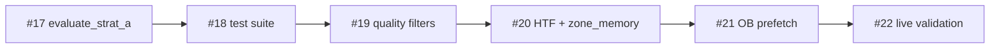

# Roadmap STRAT-A — Estrategia de Consolidación 5m al 100%

> **Objetivo:** que la Estrategia A (`STRAT-A`) quede **funcional al 100%**: arquitectura limpia, tests sólidos, filtros de calidad del PLAN MAESTRO, integración HTF/zone memory, y validación demo con Massaniello.
>
> **Fuente operativa:** features **#17–#22** en `feature_list.json` (track `strat_a`).
> **Roadmap global:** `docs/ROADMAP.md` — el track STRAT-A tiene **prioridad** sobre #7–#8 hasta completarse.

**Última actualización:** 2026-07-02

---

## Resumen ejecutivo

| Métrica | Valor |
|---------|-------|
| Features STRAT-A | 6 (#17–#22) |
| Completadas | **6** (#17–#22) ✅ |
| Siguiente | — track cerrado |
| Tests actuales STRAT-A | 135 total proyecto (`test_strat_a.py`, `test_scanner_strat_a.py`, `test_htf_zone_wiring.py`, `test_scan_prefetch.py`) |
| Demo login | ✅ PRACTICE OK — validación #22 completa (10 rechazos reject-first) |

### Definición de "100% funcional"

STRAT-A se considera **completa** cuando se cumplen **todos** estos criterios:

1. **Arquitectura** — `evaluate_strat_a()` en `strat_a.py` concentra la lógica de señal; `scanner.py` solo orquesta I/O y delega (patrón `evaluate_strat_b`).
2. **Tests** — suite unitaria + integración E2E del pipeline scanner → candidato → scorer → executor (incl. `pending_reversals`).
3. **Calidad** — filosofía *reject-first* del PLAN MAESTRO: payout ≥87%, score ≥75, zona ≥30 min (rebotes), patrón 1m obligatorio, HTF alineado (bloqueo, no solo penalización).
4. **Integración** — `HTFScanner` (15m) en background + `zone_memory` poblado en cada candidato.
5. **Rendimiento** — prefetch paralelo de velas OB (3m) sin fetch secuencial por activo en el hot path.
6. **Demo** — al menos una sesión Massaniello con señales STRAT-A: 5 entradas / 3 ITM en 60 min (requiere credenciales válidas).

---

## Estado actual (gap analysis)

### Lo que ya funciona

| Componente | Estado | Ubicación |
|------------|--------|-----------|
| Detección consolidación 5m | ✅ | `strat_a.detect_consolidation` |
| Rebote techo/piso + ruptura | ✅ | `scanner.py` ~746–1100 |
| Validación vela rechazo 1m | ✅ | `strat_a.validate_rejection_candle` |
| Order blocks + MA scoring | ✅ | `strat_a` + `entry_scorer` |
| Pending reversals | ✅ | `scanner._process_pending_reversals` |
| H1 trend filter (bloqueo) | ✅ | `H1_CONFIRM_ENABLED` + `infer_h1_trend` |
| Scoring adaptativo | ✅ | `entry_scorer.select_best` |
| Massaniello + entry sync | ✅ | `executor` + `entry_sync` |

### Lo que falta o está incompleto

| Gap | Impacto | Feature |
|-----|---------|---------|
| Sin `evaluate_strat_a()` — ~400 líneas inline en `scanner.py` | Mantenibilidad, testabilidad | #17 |
| Solo 5 tests unitarios; sin E2E STRAT-A | Regresiones silenciosas | #18 |
| `MIN_PAYOUT=80`, `ADAPTIVE_THRESHOLD_BASE=65`, zona 20 min | Edge destruido (PLAN MAESTRO §4) | #19 |
| `htf_scanner.py` existe pero **no está cableado** | Opera sin contexto 15m real | #20 |
| `zone_memory` en scorer pero **nunca se puebla** | Pierde bonus/penalización histórica | #20 |
| Fetch OB secuencial por activo en scan | Latencia en hot path | #21 |
| Demo STRAT-A no validada en vivo | "Funcional" sin evidencia operativa | #22 |

---

## Fases del track STRAT-A



### Fase SA-1 — Arquitectura (#17 `strat_a_evaluate`)

**Objetivo:** extraer `evaluate_strat_a()` siguiendo el patrón de `evaluate_strat_b()`.

**Entrada:** velas 5m, 1m, OB (opcional), MA state, zona existente, config.

**Salida:** `StratAEvaluation | None` con:
- `direction`, `entry_mode`, `stage`
- `zone`, `pattern_name`, `strength`, `confirms`
- `rejection_ok`, `skip_reason` (si rechazado)
- flags: `breakout_strength_ok`, `skip_zone_age_check`

**Criterios:**
- `scanner.py` STRAT-A branch ≤150 líneas de delegación
- Sin I/O de red en `strat_a.py` (R12)
- Comportamiento idéntico al actual (regresión cero en tests existentes)

---

### Fase SA-2 — Tests (#18 `strat_a_test_suite`)

**Objetivo:** cobertura completa del pipeline STRAT-A.

| Área | Tests nuevos |
|------|--------------|
| `evaluate_strat_a` | rebound ceiling/floor, breakout above/below, zona joven, sin consolidación |
| Patrones 1m | hammer, engulfing, shooting star, patrón blacklist PUT |
| Pending reversals | espera activa, confirmación tras N scans, expiración |
| Scanner E2E | mock velas → candidato → score ≥ umbral → `select_best` |
| Integración executor | `strategy_origin=STRAT-A`, stage initial/breakout |

**Meta:** ≥25 tests STRAT-A; `init.ps1` verde.

---

### Fase SA-3 — Filtros de calidad (#19 `strat_a_quality_filters`)

**Objetivo:** implementar filosofía *reject-first* (PLAN MAESTRO §7).

| Filtro | Actual | Objetivo |
|--------|--------|----------|
| Payout mínimo STRAT-A | 80% | **87%** (configurable `STRAT_A_MIN_PAYOUT`) |
| Score mínimo | 65 adaptativo | **75 fijo** para STRAT-A (`STRAT_A_MIN_SCORE`) |
| Edad zona (rebote) | 20 min | **30 min** (`STRAT_A_ZONE_MIN_AGE_REBOUND`) |
| Patrón 1m en rebote | opcional si score alto | **obligatorio** — sin patrón = rechazo |
| HTF 15m | no integrado | **bloqueo** si tendencia 15m contradice dirección |
| H1 | bloqueo si `H1_CONFIRM_ENABLED` | mantener; unificar con HTF 15m en #20 |

**Implementación:** constantes en `config.py` + vetos en `evaluate_strat_a` o `entry_decision_engine` (preferir veto explícito con log de rechazo).

---

### Fase SA-4 — HTF + Zone Memory (#20 `strat_a_htf_zone_wiring`)

**Objetivo:** cablear módulos existentes pero desconectados.

**HTFScanner (15m):**
- Iniciar `HTFScanner` como `asyncio.create_task` en `consolidation_bot` / `main.py`
- En scan: `candles_15m = htf.get_candles_15m(sym)` — sin fetch bloqueante
- Pasar tendencia 15m a `evaluate_strat_a` y scorer

**Zone Memory:**
- En construcción de candidato: `query_nearby_zones(journal_path, asset, price)`
- Asignar `candidate.zone_memory = zones`
- Verificar que `score_breakdown["zone_memory"]` ≠ 0 cuando hay historia

**Opcional:** integrar `entry_decision_engine` para vetos unificados (muro histórico, HTF, patrón).

---

### Fase SA-5 — OB Prefetch (#21 `strat_a_ob_prefetch`)

**Objetivo:** eliminar fetch OB secuencial dentro del bucle por activo.

- Prefetch OB 3m en paralelo con velas 5m/1m (reutilizar `parallel_fetch` + `candle_cache`)
- Cache por activo/tf con TTL
- `evaluate_strat_a` recibe blocks precalculados

**Criterio:** tiempo de scan por ciclo no aumenta con N activos (medición en test o log).

---

### Fase SA-6 — Validación demo (#22 `strat_a_live_validation`)

**Objetivo:** evidencia operativa de STRAT-A en demo.

**Precondición:** credenciales Quotex válidas en `.env`.

**Protocolo:**
1. Forzar `STRAT-B` y `STRAT-MOMENTUM` off (solo STRAT-A)
2. Ejecutar bot en PRACTICE ≥60 min
3. Registrar: señales STRAT-A, entradas, resultados, log `SESIÓN MASSANIELLO CUMPLIDA`
4. Documentar en `progress/history.md`

**Criterio de éxito:** ≥3 señales STRAT-A ejecutadas con filtros SA-3 activos; sesión Massaniello cumplida o evidencia de rechazos correctos (reject-first funcionando).

---

## Dependencias con roadmap global

| Feature global | Relación con STRAT-A |
|----------------|---------------------|
| #1 `refactor_monolith` | ✅ Base — `strat_a.py` existe |
| #3–#5 performance | ✅ Prefetch + cache + sync ya activos |
| #7 `strategy_reversal_swing` | **Pausada** hasta cerrar track STRAT-A |
| #8 `strategy_order_block` | OB parcial en STRAT-A; #8 lo generaliza |
| #9 `backtesting_engine` | Útil post-#22 para validar offline |
| #11 `massaniello_persistence` | Recomendada antes de sesiones largas demo |

---

## Orden de implementación (SDD)

```
#17 pending → spec_author → spec_ready → ⏸ HUMANO → in_progress → implementer → reviewer → done
#18 … (misma secuencia)
…
#22 (validación — puede omitir spec si es solo ops; ver feature_list)
```

**Regla:** una feature STRAT-A a la vez. No mezclar con #7–#8.

---

## Métricas de éxito (PLAN MAESTRO §9)

| Métrica | Antes (estimado) | Objetivo post-track |
|---------|------------------|---------------------|
| Winrate STRAT-A | desconocido | ≥60% (journal) |
| Entradas/sesión | sin límite explícito | ≤5 (Massaniello) |
| Score promedio entradas | ~67–72 | ≥75 |
| Payout promedio | ~83% | ≥87% |
| Entradas sin HTF alineado | permitidas | **0** |
| Entradas sin patrón 1m (rebote) | permitidas | **0** |
| Entradas zona <30 min (rebote) | penalización leve | **bloqueadas** |

---

## Changelog

| Fecha | Cambio |
|-------|--------|
| 2026-06-30 | Creación del track STRAT-A (#17–#22); prioridad sobre estrategias #7–#8 |